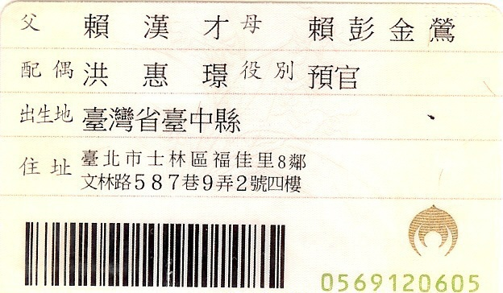

# IDCardOCR

這是一個身份證OCR識別系統，能夠自動拍攝並識別身份證上的地址資訊。

### 原始圖片


### 識別結果


## 功能特色

- 相機拍攝身份證圖像
- 自動校正圖像方向
- 精準識別身份證上的地址欄位
- 簡體轉繁體中文轉換
- 完整的日誌記錄系統

## 安裝需求

- Python 3.x
- PaddleOCR
- OpenCV
- Pillow
- OpenCC (簡繁轉換)

## 快速開始

1. 安裝必要套件：

```
pip install -r requirements.txt
```

2. 確保字體檔案存在於 `./font/` 目錄下

3. 執行主程式：

```bash
python src/main/IDCardProcessor.py
```

## 使用方法

1. 啟動程式後，攝像頭會自動開啟
2. 將身份證放在攝像頭前方
3. 按下 Enter 鍵拍攝身份證
4. 系統會自動處理影像並識別地址
5. 識別結果會顯示在終端機，並將結果圖片儲存至 `./pic/result.jpg`

## 專案結構

- [src/main/Camera.py](src/main/Camera.py) - 相機控制模組
- [src/main/IDCardOCR.py](src/main/IDCardOCR.py) - OCR 識別核心
- [src/main/IDCardProcessor.py](src/main/IDCardProcessor.py) - 主程式流程控制
- [src/main/ImageProcessor.py](src/main/ImageProcessor.py) - 圖像處理模組
- [src/main/Logger.py](src/main/Logger.py) - 日誌記錄模組
- [src/tests/](src/tests/) - 測試程式碼